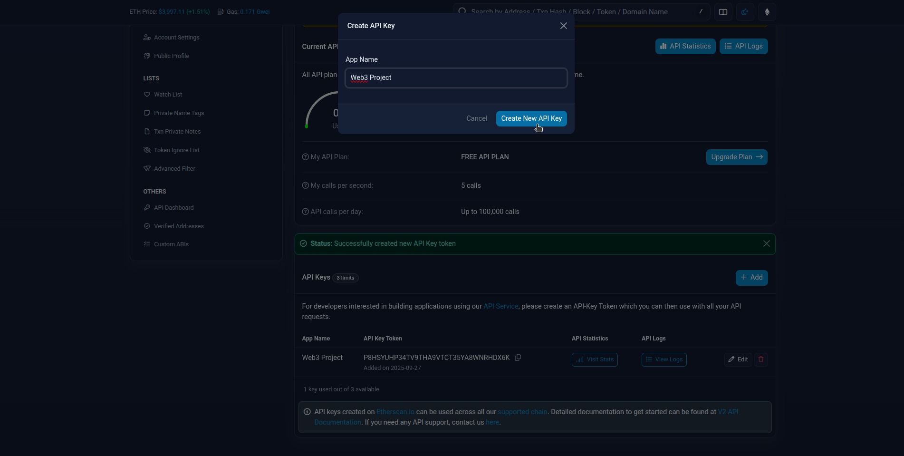

# TP Etherscan Web3 Dom

TP manipulation du DOM et des APIs en HTML CSS et Javascript Vanilla.

Vous devez intégrer en format desktop et mobile un visualiseur de transactions d'un wallet Ethereum en Html Css et Javascript.

## Informations Utiles

**Lien Projet Github:** [Projet Github](https://github.com/orgs/EdenSchoolFrance/projects/62/views/1)

**Lien maquette Figma:** [Maquette Figma](https://www.figma.com/design/4bpNcOLGPuyr2wl333S66U/blockhain-wallet-tx?t=ikHxSumvdOmlCN0l-1)

**Lien Etherscan API (v2):** `https://docs.etherscan.io`

**Avant de commencer**

1. Connectez-vous ou inscrivez-vous sur le site [https://etherscan.io/register](https://etherscan.io/register)
2. Rendez-vous sur la dashboard de l'API via [https://etherscan.io/apidashboard](https://etherscan.io/apidashboard)
3. Créer votre `API KEY` en cliquant sur le bouton `+ Add` dans la section en base de page

## Objectifs

A partir du [Kanban Github](https://github.com/orgs/EdenSchoolFrance/projects/62/views/1) que vous aurez dupliquer sur votre compte github, vous devez intégrer chaque fonctionnalité **sur une branche git séparée**.

Pour chaque fonctionnalité présente dans le Kanban, vous devez:

1. Créer une branche git et la nommée en respectant [la convention de nommage](https://codeheroes.fr/blog/git-comment-nommer-ses-branches-et-ses-commits/) (ex: "feat/add-wallet-read" pour coder la fonctionnalité "Lire le solde de son wallet")
2. Publier votre code en créant une PR (Pull-Request) puis la documenter en utilisant le markdown
3. Valider votre PR en demandant à l'un de vos camarades de Review votre PR

## Questions

### Comment créer une PR depuis Github ?

Une PR (Pull-Request) se créer automatiquement à partir de la branche que vous publier sur votre repo git.

Pour créer un PR sur github:

1. Créez une branche, ajoutez des commits, puis publiez-la
2. Rafraichissez dans un navigateur la page de votre repo github (une notification devrait apparaitre). Si ce n'est pas le cas, allez sur l'onglet "Pull-Request".
3. Cliquer sur le bouton "Créer une Pull-Request", puis rediger la documentation de la PR en markdown pour décrire les tâches réalisées dans celle-ci.

